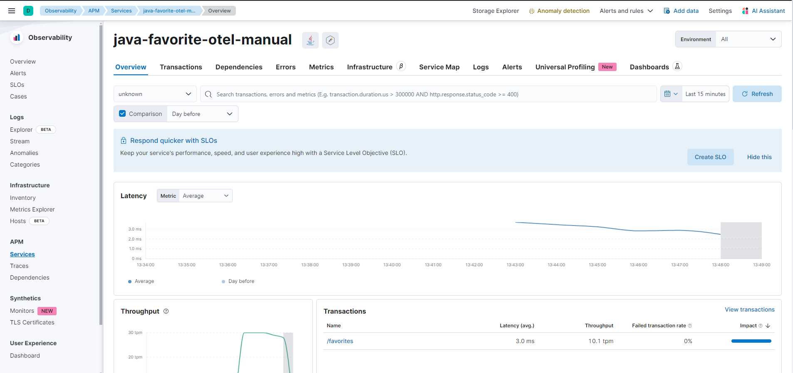

# otel-java-manual-instrumentation

* Pre-requiste 
       Elastic and APM Server
       Java Application(src: Hello World)
       Opentelentry Agent java
       Docker

Note: We are integrating the OpenTelemetry agent directly with the Java application during the Docker build process.

Step 1 - You will need to copy the following environment variables from Elastic APM.

       
       OTEL_EXPORTER_OTLP_ENDPOINT
       OTEL_EXPORTER_OTLP_HEADERS
    

Step 2 - Edit Docker file and add below configuration to attach Opentelementry Java Agent after ```mvn clean install```.

       USER root
       RUN apt-get update && apt-get install -y zip curl
       RUN mkdir /otel
       RUN curl -L -o /otel/opentelemetry-javaagent.jar https://github.com/open-telemetry/opentelemetry-java-instrumentation/releases/download/v1.28.0/opentelemetry-javaagent.jar
       

Step 3 - Build the Docker image or you can download docker from .

       
       docker build -t java-otel-manual-image .
       docker login
       docker push java-otel-manual-image:latest

                     or 

       docker pull navynyx/java-otel-manual-image:latest
       

Step 4 - Run the Docker image.

       ```
       docker run \
              -e OTEL_EXPORTER_OTLP_ENDPOINT="https://xxxxxxxxxxxxxxxxx.com:443" \
              -e ELASTIC_APM_SECRET_TOKEN="999999999999999" \
              -e OTEL_RESOURCE_ATTRIBUTES="service.version=1.0,deployment.environment=production" \
              -e OTEL_SERVICE_NAME="java-favorite-otel-manual" \
              -p 5000:5000 \
              java-otel-manual-image
       ```

Step 5 - You can now issue a few requests in order to generate trace data.

       ```
       curl localhost:5000/favorites

       # or alternatively issue a request every 2 second

       while true; do curl "localhost:5000/favorites"; sleep 2; done;

       ```

Step 6 - Explore traces and logs in Elastic APM


