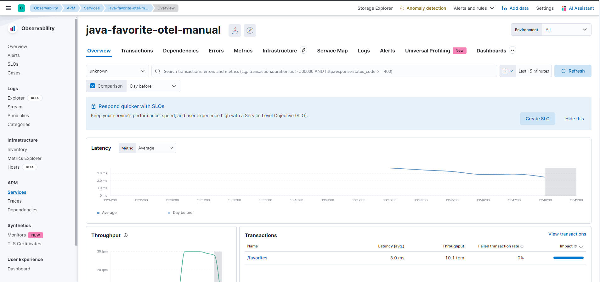

# otel-java-manual-instrumentation

Pre-requiste 
Elastic and APM Server
Docker

Note: We are integrating the OpenTelemetry agent directly with the Java application during the Docker build process.

Step 1 - You will need to copy the following environment variables
```
OTEL_EXPORTER_OTLP_ENDPOINT
OTEL_EXPORTER_OTLP_HEADERS
```

Step 2 - Build the Docker image
``` 
docker build -t java-otel-manual-image .
```

Step 3 - Run the Docker image
```
docker run \
       -e OTEL_EXPORTER_OTLP_ENDPOINT="https://xxxxxxxxxxxxxxxxx.com:443" \
       -e ELASTIC_APM_SECRET_TOKEN="999999999999999" \
       -e OTEL_RESOURCE_ATTRIBUTES="service.version=1.0,deployment.environment=production" \
       -e OTEL_SERVICE_NAME="java-favorite-otel-manual" \
       -p 5000:5000 \
       java-otel-manual-image
```

Step 4 - You can now issue a few requests in order to generate trace data
```
curl localhost:5000/favorites

# or alternatively issue a request every 2 second

while true; do curl "localhost:5000/favorites"; sleep 2; done;

```

Step 5 - Explore traces and logs in Elastic APM

